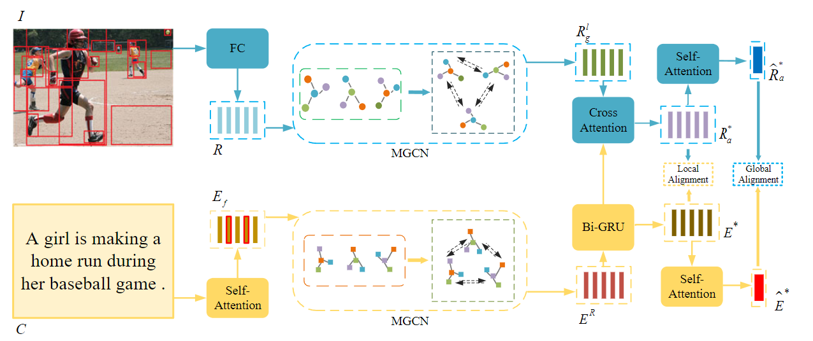

# Learning Hierarchical Semantic Correspondences for Cross-Modal Image-Text Retrieval (LHSC)

PyTorch implementation for ICMR '22(Proceedings of the 2022 International Conference on Multimedia Retrieval) paper of  “Learning Hierarchical Semantic Correspondences for Cross-Modal Image-Text Retrieval”. It is build on of the [SGRAF](https://github.com/Paranioar/SGRAF).

The paper was awarded **BEST STUDENT PAPER**

Sheng Zeng, Changhong Liu, Jun Zhou, Yong Chen, Aiwen Jiang, Hanxi Li. "Learning Hierarchical Semantic Correspondences for Cross-Modal Image-Text Retrieval", ICMR, 2022. [[pdf](https://doi.org/10.1145/3512527.3531358)]

## Introduction

Cross-modal image-text retrieval is a fundamental task in information retrieval. The key to this task is to address both heterogeneity and cross-modal semantic correlation between data of different modalities. Fine-grained matching methods can nicely model local semantic correlations between image and text but face two challenges. First, images may contain redundant information while text sentences often contain words without semantic meaning. Such redundancy interferes with the local matching between textual words and image regions. Furthermore, the retrieval shall consider not only low-level semantic correspondence between image regions and textual words but also a higher semantic correlation between different intra-modal relationships. We propose a multi-layer graph convolutional network with object-level, object-relational-level, and higher-level learning sub-networks. Our method learns hierarchical semantic correspondences by both local and global alignment. We further introduce a self-attention mechanism after the word embedding to weaken insignificant words in the sentence and a cross-attention mechanism to guide the learning of image features. Extensive experiments on Flickr30K and MS-COCO datasets demonstrate the effectiveness and superiority of our proposed method.



## Requirements

We recommended the following dependencies.

* Python 2.7
* [PyTorch](http://pytorch.org/) (0.4.1)
* [NumPy](http://www.numpy.org/) (>1.12.1)
* [TensorBoard](https://github.com/TeamHG-Memex/tensorboard_logger)
* [pycocotools](https://github.com/cocodataset/cocoapi)
* [torchvision]()
* [matplotlib]()
* Punkt Sentence Tokenizer:

```python
import nltk
nltk.download()
> d punkt
```

## Download data

Download the dataset files and pre-trained models. We use splits produced by [Andrej Karpathy](http://cs.stanford.edu/people/karpathy/deepimagesent/).

We follow [bottom-up attention model](https://github.com/peteanderson80/bottom-up-attention) and [SCAN](https://github.com/kuanghuei/SCAN) to obtain image features for fair comparison. More details about data pre-processing (optional) can be found [here](https://github.com/kuanghuei/SCAN/blob/master/README.md#data-pre-processing-optional). All the data needed for reproducing the experiments in the paper, including image features and vocabularies, can be downloaded from [SCAN](https://github.com/kuanghuei/SCAN) by using:

```bash
wget https://scanproject.blob.core.windows.net/scan-data/data.zip
```

Baidu Netdisk:
https://pan.baidu.com/s/1Jg_ZN2HR5h_EntghbxbhGg?pwd=l1h4
You can also get the data from google drive:
https://drive.google.com/drive/u/1/folders/1os1Kr7HeTbh8FajBNegW8rjJf6GIhFqC. We refer to the path of extracted files for `data.zip` as `$DATA_PATH`.aluate pre-trained models

Modify the model_path and data_path in the evaluation.py file. Then Run `evaluation.py`:

```bash
python evaluation.py
```

To do cross-validation on MSCOCO 1K test set (5 folders average), pass `fold5=True`. Pass `fold5=False` for evaluation on MSCOCO 5K test set. Pretrained models for MSCOCO and Flickr30K can be downloaded from https://drive.google.com/file/d/1y8Ywa2vrPB7m_Q_Ku69z7EdwsLB9gsJW/view?usp=sharing

## Training new models

Run `train.py`:

For MSCOCO:

```bash
python train.py --data_name coco_precomp --num_epochs 50 --lr_update 20
```

For Flickr30K:

```bash
python train.py --data_name f30k_precomp --num_epochs 50 --lr_update 20
```

## Reference

If you found this code useful, please cite the following paper:

    @inproceedings{10.1145/3512527.3531358,
      title = {Learning Hierarchical Semantic Correspondences for Cross-Modal Image-Text Retrieval},
      author = {Zeng, Sheng and Liu, Changhong and Zhou, Jun and Chen, Yong and Jiang, Aiwen and Li, Hanxi},
      booktitle={ICML},
      publisher = {Association for Computing Machinery},
      address = {New York, NY, USA},
      year={2022}
    }

## License

[Apache License 2.0](http://www.apache.org/licenses/LICENSE-2.0)
